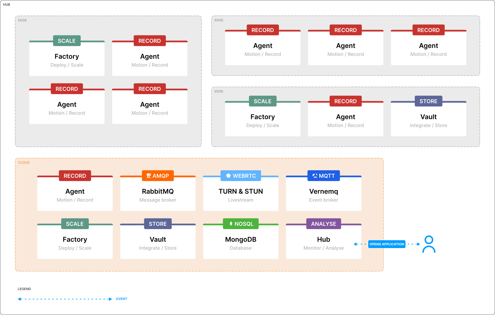
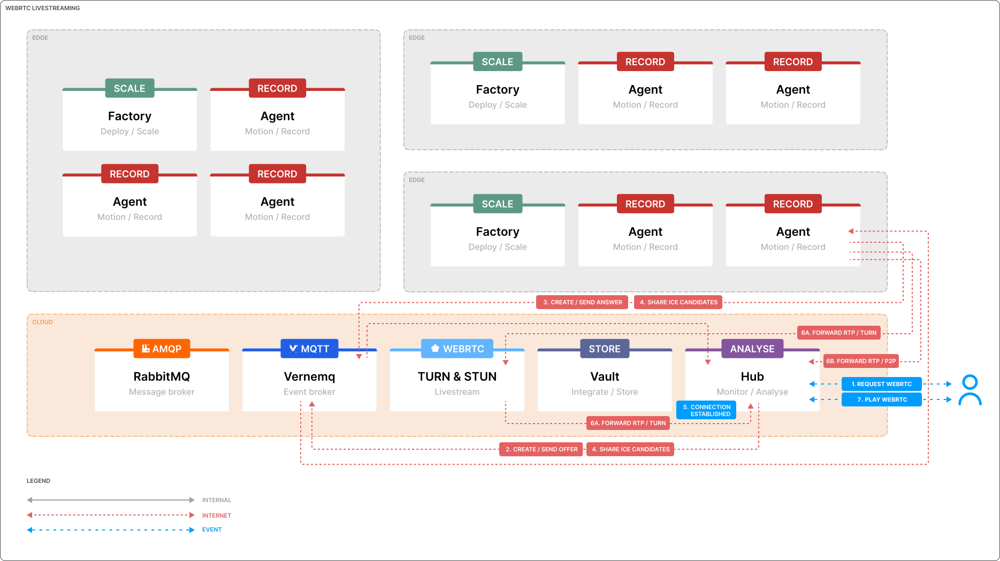

# Hub

Hub is the single pane of glass for your Agents. It comes with a best-of-breed open-source technology stack, a modular and scale-first mindset, and allows you to build and maintain an ever-growing video surveillance and video analytics landscape. With Hub, you can seamlessly integrate various components, ensuring a robust and scalable solution for all your video monitoring needs. Whether you are managing a few cameras or a large-scale deployment, Hub provides the tools and flexibility to adapt and grow with your requirements.


Hub offers an extensive set of features that enable you to scale and manage a comprehensive video surveillance landscape:

- Organize cameras with groups and sites for better governance.
- High-definition on-demand live streaming.
- Daily recording overviews.
- Real-time notifications with configurable alerts.
- Advanced video analytics using machine learning models.
- And many more features.

## :books: Overview

### Introduction

1. [License](#license)
2. [Building blocks and components](#building-blocks-and-components)
3. [Architecture](#architecture)
4. [API and integration](#api-and-integration)

### Installation

5. [Prerequisites](#prerequisites)
   - [Add helm repos](#add-helm-repos)
   - [Cert manager](#cert-manager)
   - [Message broker / queue](#message-broker-or-queue)
   - [Event broker](#event-broker)
   - [Database](#database)
   - [TURN/STUN](#turnstun)
   - [Ingress](#ingress)
6. [Kerberos Hub](#kerberos-hub)
   - [Kerberos Hub Object Detector](#kerberos-hub-object-detector)

# Introduction

Before we proceed with the installation, it is crucial to understand the key considerations and prerequisites for deploying Hub. The following paragraphs will provide an overview of the essential components and configurations required to ensure a successful and efficient installation of Hub in your environment.

## License

> To request a license you can reach out to `support@kerberos.io`.

To start using Hub, you'll require a license. This license will grant access to the Hub and allow you to connect a specific number of Agents and Vaults. Hub can be installed without a license key, allowing you to verify the installation before entering into a license agreement. This ensures you are confident in your deployment.

The license key ensures business continuity in the event of license expiration. Once the license expires, the system will continue to work (no data loss); however, you will be prompted on the login page that your license has expired, and you will no longer be able to sign in.

A license key specifies the number of Agents and cameras you can connect to the Hub, as well as the duration of the license period. If the number of Agents exceeds the licensed amount, Hub will continue to operate, but you will receive a notification prompting you to upgrade your license.

[A free license](https://github.com/kerberos-io/helm-charts/blob/main/charts/hub/values.yaml#L10-L11) is included with the existing deployment, allowing you to connect up to 8 Agents to Hub. If you need to connect more than 8 Agents, please contact us to request an extended license.

## Building blocks and components

Hub is composed of and relies on several open-source components to ensure scalability and high availability. The key components include:

- **Kubernetes**: Orchestrates the deployment, scaling, and management of containerized applications.
- **MongoDB**: Storage of metadata about Agents, recordings, notifications, and more.
- **MQTT broker**: Facilitates bi-directional communication between Agents and Hub.
- **AMQP broker**: Handles asynchronous event processing within the Hub.
- **TURN/STUN server**: High definition (WebRTC) live streaming

All the components mentioned above are prerequisites for a complete Hub installation. Missing any component, such as a TURN/STUN server, will result in certain features, like live streaming, not functioning. Once all components are in place, you can finalize the installation by configuring and deploying Hub using our [Helm chart](https://github.com/kerberos-io/helm-charts/tree/main/charts/hub) in your Kubernetes cluster. Additionally, you have the flexibility to use managed services, such as MongoDB on Azure, RabbitMQ on Amazon Web Services, or a TURN/STUN server on a virtual machine.

Hub is designed to be stateless, relying on the previously mentioned components for state persistence. For high availability, resilience, and scalability, we strongly recommend deploying Hub in Kubernetes. As a best practice, consider running stateful workloads outside the Kubernetes cluster when possible. For example, outsourcing MongoDB management can reduce operational overhead, allowing you to focus on other critical deployment aspects. However, in some cases, such as air-gap deployments, you may need to host all components within Kubernetes.

## Architecture

Hub, Vault, Factory, and Agents support various deployment options: on-premise, hybrid, cloud, and combinations thereof. Depending on your project's requirements, you can choose the most suitable deployment strategy. For an overview of the different deployment options, visit our [documentation website](https://doc.kerberos.io/prologue/deployments/).

As described in the [building blocks and components section](#building-blocks-and-components), Hub relies on various open-source components. The architecture below illustrates the flexibility you have in deploying each component. For instance, you can:

- Deploy your Agents at the edge, with or without Factory.
- Implement edge storage with Vault for buffering or machine learning.
- Opt for a complete offline deployment.
- Explore various other deployment configurations to suit your needs.



The selected components are as follows:

- **Kubernetes**: Options include Kubernetes, Microk8s, K3S, Kind, Azure Kubernetes Service, and more.
- **MongoDB**: Utilized as our NoSQL database.
- **MQTT broker**: Compatible with Vernemq, Mosquitto, or any other MQTT broker.
- **AMQP broker**: Supports RabbitMQ, Kafka, or any AMQP-compliant broker.
- **TURN/STUN server**: Coturn is recommended.

## API and integration

Hub is a scalable and flexible solution that allows any size and type of deployment. Next to that, it also makes the internal APIs available [through Swagger](https://api.cloud.kerberos.io/swagger/index.html). This allows you to build your own application on top of the Hub backbone. For example, you could retrieve the existing devices, users, recordings from a specific user.

    curl -X 'GET' 'https://api.cloud.kerberos.io/devices' -H 'accept: application/json'

Within the [`/examples`](./examples/) folder, you will find examples demonstrating how to create your own front-end application using React or another front-end framework of your choice. These examples showcase how to list available Agents for a specific user, open a live stream, and control the pan-tilt-zoom functionality of a camera.

# Installation

As discussed previously, you have the flexibility to install Hub along with its essential components such as Agent, Factory, and Vault based on your specific requirements. The following sections will guide you through the step-by-step process of installing Hub in your Kubernetes cluster.

## Add Helm Repositories

To install Hub, you need to add several Helm repositories to your Kubernetes cluster. These repositories contain the necessary Helm charts for Hub and its dependencies.

    helm repo add bitnami https://charts.bitnami.com/bitnami
    helm repo add jetstack https://charts.jetstack.io
    helm repo add vernemq https://vernemq.github.io/docker-vernemq
    helm repo add kerberos https://charts.kerberos.io
    helm repo update

## Cert manager

We use cert-manager and Let's Encrypt to generate the necessary certificates for the Hub application and its depending components. As a best practice, we will install each dependency in its own namespace. Let's begin by creating a dedicated namespace for cert-manager.

    kubectl create namespace cert-manager

Install the cert-manager Helm chart into the `cert-manager` namespace.

    helm install cert-manager jetstack/cert-manager --namespace cert-manager --set installCRDs=true

If you already have the CRDs installed, you can omit the `--set installCRDs=true` flag.

Next, we will install a cluster issuer to handle HTTP01 challenges. This is necessary for resolving the certificates for both the Kerberos Hub web interface and API.

    kubectl apply -f cert-manager/cluster-issuer.yaml

## Message broker or queue

To enhance integration, scalability, and resilience, the Hub pipeline utilizes a message broker to ensure a robust message flow. The message broker integrates various microservices within Hub, allowing you to scale specific microservices independently. Currently, we support two primary message brokers: RabbitMQ and Kafka. Depending on your existing infrastructure and expertise, you may prefer one over the other.

### RabbitMQ (preferred)

RabbitMQ is the preferred message broker due to its ease of setup, scalability, and built-in high availability. RabbitMQ efficiently distributes messages to various consumers, such as microservices. You can choose to self-host RabbitMQ as shown below, or use a managed RabbitMQ service provided by cloud providers like Amazon Web Services (AWS), Google Cloud Platform (GCP), or Microsoft Azure. Both Advanced Message Queuing Protocol (AMQP) and AMQP Secure (AMQPS) protocols are supported. RabbitMQ serves as an orchestrator for the Hub pipeline, creating multiple queues linked to various microservices.

As a best practice, let's create a separate namespace for rabbitmq.

    kubectl create namespace rabbitmq

Before installing the [RabbitMQ Helm chart](https://github.com/bitnami/charts/tree/main/bitnami/rabbitmq), review the `rabbitmq/values.yaml` file. This file contains various configuration options such as `username`, `password`, and `replicaCount`. Adjust these settings according to your preferences and use case.

    helm install rabbitmq bitnami/rabbitmq -n rabbitmq -f rabbitmq/values.yaml --version 11.12.0

You might need to add a few CRDs. If you see the following error: `unable to recognize "": no matches for kind "ServiceMonitor" in version "monitoring.coreos.com/v1`, you need to install the Prometheus operator CRDs. To install the Prometheus operator CRDs, run the following command:

    kubectl create -f https://raw.githubusercontent.com/prometheus-operator/prometheus-operator/master/bundle.yaml

### Kafka

Kafka is also an option but RabbitMQ is preferred. It behaves the same as RabbitMQ, consuming messages from a queue, or a topic in the case of Kafka. Kafka is integral to the Hub pipeline, where microservices operate in parallel and/or sequentially. These microservices consume events from a Kafka topic, process the recordings and their metadata, and then produce results back into Kafka for subsequent microservices. Each microservice can scale horizontally through replicas, allowing you to distribute workloads across nodes as needed.

As a best practice, let's create another namespace.

    kubectl create namespace kafka

Before installing the Kafka helm chart, go and have a look in the kafka/values.yaml file. You should update the clientUsers and clientPasswords. Have a look at the zookeeper credentials as well and update accordingly. Make sure to install version 18.4.4, as this `values.yaml` is matched for that specific helm release.

    helm install kafka bitnami/kafka -f ./kafka/values.yaml -n kafka  --version 20.0.2

## Event broker

In addition to a message broker, we utilize an event broker (MQTT) for bidirectional communication within the Hub ecosystem. We recommend using Vernemq in a self-hosted scenario due to its horizontal scalability. However, you can also opt to install a `mosquitto` MQTT broker on a separate virtual machine or use a managed MQTT broker from cloud providers like Amazon Web Services (AWS), Google Cloud Platform (GCP), or Microsoft Azure, depending on your preference.

### Vernemq

Let's create a dedicated namespace for our event broker, Vernemq.

    kubectl create namespace vernemq

To handle TLS/WSS, you need to create a certificate using a DNS challenge. Follow these steps to set up the certificate:

1. **Create a Secret for DNS Challenge**:

   ```sh
   kubectl apply -f vernemq/vernemq-secret.yaml --namespace cert-manager
   ```

2. **Create a Cluster Issuer**:

   ```sh
   kubectl apply -f vernemq/vernemq-issuer.yaml --namespace vernemq
   ```

3. **Create the Certificate**:
   ```sh
   kubectl apply -f vernemq/vernemq-certificate.yaml --namespace vernemq
   ```

Ensure that the DNS records are correctly configured to point to your cluster for the DNS challenge to succeed.

By default, a username and password are set for the Vernemq broker. You can find these in the `vernemq/values.yaml` file.

```yaml
- name: DOCKER_VERNEMQ_USER_YOURUSERNAME
  value: "yourpassword"
```

Please note that the username is defined in uppercase as `YOURUSERNAME`, but it will be converted to lowercase as `yourusername`. Any text written in uppercase will be transformed to lowercase. Proceed to install the Vernemq chart with the appropriate configuration options.

    helm install vernemq vernemq/vernemq -f vernemq/values.yaml --namespace vernemq

## Database

Within Kerberos Hub data is stored/required for users, recordings, sites, groups, and many other entities. As for now, the entire Kerberos.io technology stack is relying on MongoDB.

### MongoDB

A MongoDB instance is used for data persistence. Data might come from the Kerberos Pipeline or user interaction on the Kerberos Hub frontend. You can consider using managed MongoDB (through [MongoDB Atlas](https://www.mongodb.com/cloud/atlas) or a cloud provider like AWS, GCP, or Azure) or you can use the self-hosted deployment as mentioned below.

For the self-hosted deployment, we will be using [the official bitnami mongodb helm chart](https://github.com/bitnami/charts/tree/main/bitnami/mongodb). Please navigate to their [repository](https://github.com/bitnami/charts/tree/main/bitnami/mongodb) for more configuration options.

We will create a namespace for our MongoDB deployment as well.

    kubectl create namespace mongodb

Create a persistent volume, this is where the data will be stored on disk.

    kubectl apply -f ./mongodb/fast.yaml

Before installing the MongoDB helm chart, go and have a look in the `mongodb/values.yaml` file. You should update the root password to a custom secure value.

    helm install mongodb bitnami/mongodb --values ./mongodb/values.yaml -n mongodb

## TURN/STUN

Within Hub, we allow streaming live from the edge to the cloud without port-forwarding. To make this work, we are using a technology called WebRTC that leverages a TURN/STUN server.



To run a TURN/STUN, we recommend installing coturn on a dedicated/stand-alone machine. The TURN/STUN server will make sure a connection from an Agent to a Hub viewer is established. More information on how to install coturn and configure it on an Ubuntu machine can be [found here](https://www.linuxbabe.com/linux-server/install-coturn-turn-server-spreed-webrtc).

    sudo apt install coturn
    systemctl status coturn
    sudo systemctl start coturn

Make the appropriate changes in the `turnserver.conf`, for example, the DNS name and user credentials.

    sudo nano /etc/turnserver.conf

## Ingress

Ingresses are needed to expose the Kerberos Hub front-end and API to the internet or intranet. We prefer nginx ingress but if you would prefer Traefik, that is perfectly fine as well.

### Nginx

We'll use the following helm chart `ingress-nginx` for setting up nginx in our cluster.

    helm upgrade --install ingress-nginx ingress-nginx \
    --repo https://kubernetes.github.io/ingress-nginx \
    --namespace ingress-nginx --create-namespace

On AKS add the following attribute, otherwise nginx will not be accessible through `LoadBalancer`. You will receive a not reachable error.

    --set controller.service.externalTrafficPolicy=Local

# Hub

So once you hit this step, you should have installed all previously defined dependencies. Go to [the Hub helm chart repo](https://github.com/kerberos-io/helm-charts/blob/main/charts/hub), there you'll find all the relevant information for configuring and creating an instance of Hub.

If you already know what to do, grab the latest `values.yaml` at the [Hub Helm chart repo](https://github.com/kerberos-io/helm-charts/blob/main/charts/hub/values.yaml), and reference it from your `helm install` or `helm upgrade` command.

Install the Hub chart in a specific namespace and take into account the values.yaml file.

    helm install hub kerberos/hub --values values.yaml -n kerberos-hub --create-namespace

Upgrade the Hub chart

    helm upgrade hub kerberos/hub --values values.yaml -n kerberos-hub

Uninstall the Hub chart

    helm uninstall hub -n kerberos-hub
