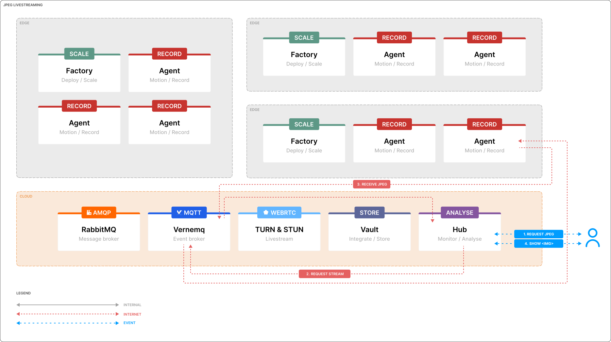

# Standard definition (JPEG) live streaming

Hub provides two types of live view: a low resolution live view and a high resolution (on demand) live view. Depending on the application you might leverage one over the other, or, both. Below we will explain the differences, and how to open and negotiate a low resolution live view with the Agent using the concepts of MQTT and JPEG. It's important to understand that live view is an on-demand action, which requires a negotiation between the requesting client (Hub or this example application) and the remote Agent. This negotiation will setup a sessions between the client and the Agent, for a short amount of time. Once the client closes the connection or the web page, the Agent will also stop forwarding the live view.

## Architecture

Hub and Agent provide a low resolution live view, which includes a single frames per second (FPS) stream. To enable this functionality, the MQTT protocol is used for requesting a stream of JPEGs. We will describe the communication flow in detail below.

The negotiation of a JPEG stream is pretty straight forward, we'll detail each step below.

## 1. Request JPG

An user opens the application, and either activates the JPEG (SD) stream or the application automatically loads the JPEG stream without any user interaction (for example video wall behaviour).

## 2. Request stream

A `request-sd-stream` payload is created and transferred to the remote Agent using a MQTT broker. The payload includes all necessary information such as the desired Agent, the action, etc. In essence the `request-sd-stream` is a polling mechanism, as it will be sending the `request-sd-stream` payload continuously in a interval; for example every 3 seconds. As a response the remote Agent uses this approach to understand if a user is still expecting a live stream to be shown in the application. As soon as the user closes the application or web page the remote Agent will stop receiving the `request-sd-stream` payload and in a response will also stop sending the live stream.

    setInterval(() => {
        this.publish();
    }, 3000);

    publish() {
        const payload = {
            action: "request-sd-stream",
            device_id: this.name,
            value: {
                timestamp: Math.floor(Date.now() / 1000),
            }
        };
        this.mqtt.publish(payload);
    }

## 3. Receive JPEG

As soon as the first Agent received the `request-sd-stream` payload it will start encoding individual frames from the underlaying RTSP stream and forward it as a JPEG to the MQTT broker. In a response the client will subscribe to the MQTT topic and will be able to decrypt the payload to a valid base64 encoded image.

    subscribe() {
        // We're listening for the "receive-sd-stream" action for the specific
        // camera (all other actions are ignored).
        // Each time we receive a message with this action, we update the liveview state.
        this.mqtt.on(this.name, (_, message) => {
            const { payload } = message;
            if (payload.action === "receive-sd-stream") {
                const { value } = payload;
                this.setState({
                    liveview: value.image
                });
            }
        });
    }

To increase performance the Agent will decode, so called, keyframes. This allows to have a bit more performant way of translating the raw RTP packets into a JPEG stream. Keyframes are special RTP packets which store information of an entire frame.

As we work with keyframes, this means that the live stream in SD is also dependent of the keyframe interval of a camera. If a keyframe is only send once each 30 frames, and the frames per second (FPS) for the camera is set to 30, it means that the live view in SD will only show 1 frame per second. When the keyframe interval is set to 15 and the frames per second (FPS) is set to 30, the live view in SD will show 2 frames per second.

## 4. Show 

The decrypted image, in base64 format, will then be able to inserted into a `` tag. Each time a new decoded image is send to MQTT, the client will rerender the `` component and show the latest image.

    

## Example

In the `ui` folder a React application is added which contains a working example using our [`demo enviroment`](https://app-demo.kerberos.io). To run the project, install the dependencies and run the project using `npm install`.

    cd ui/
    npm install
    npm start
