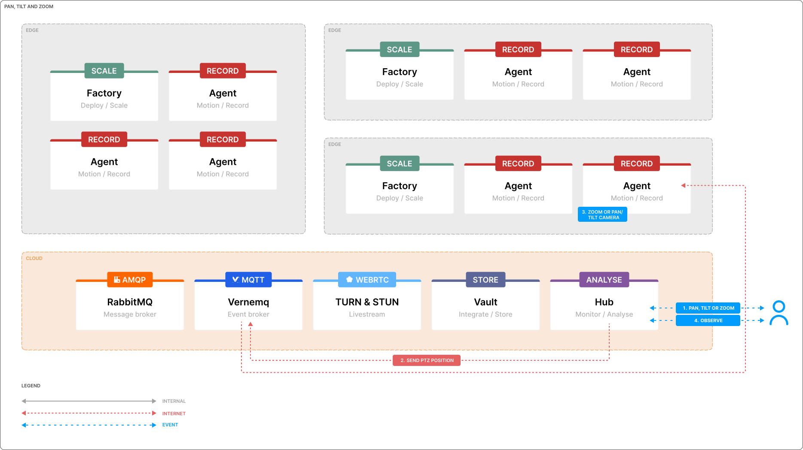

# Pan-tilt and zoom (PTZ)

Hub enables remote control of your camera's pan, tilt, and zoom (PTZ) functions. This is accomplished through communication between the Hub and a remote Agent using the MQTT protocol. Users can pan left, right, tilt up, down, or zoom in and out from the Hub interface. When combined with the real-time high-definition live stream, users can monitor and control their cameras with minimal delay.

## Architecture

Hub and Agent communicate through an encrypted MQTT connection. When a user accesses the Hub and activates pan, tilt, or zoom functions, an encrypted MQTT message is sent from the Hub to the Agent. The Agent then translates this request into an ONVIF payload, which is sent directly to the camera's ONVIF API.

## 1. Pan, tilt or zoom

When a user opens the application and selects a specific Agent, controls for pan, tilt, and zoom are displayed as an overlay on the live view. By hovering over the live view, the user can access these controls and select the desired pan, tilt, or zoom function.

## 2. Send PTZ position

A `navigate-ptz` payload is created and transferred to the remote Agent using an MQTT broker. The payload includes all necessary information such as the desired Agent, the action, etc. When a user clicks a specific action (e.g., move right, zoom in), an individual `navigate-ptz` payload is sent. This ensures that each action is executed immediately and accurately. As soon as the user performs another action, a new payload is sent to update the PTZ functions accordingly.

    // For pan/tilt: move right (=1)
     const action = {
        action: "ptz",
        payload: {
            up: 0,
            down: 0,
            left: 0,
            right: 1,
            center: 0,
        }
    };

    // For zoom: in (use 1), out (use -1)
    const action = {
        action: "zoom",
        payload: {
            zoom: 1,
        }
    };

    publish(action) {
        const payload = {
            action: "navigate-ptz",
            device_id: this.name,
            value: {
                timestamp: Math.floor(Date.now() / 1000),
                action: JSON.stringify(action)
            }
        };
        this.mqtt.publish(payload);
    }

## 3. Zoom or pan-tilt camera

Once the Agent receives the MQTT payload, it will parse the `navigate-ptz` action and generate an appropriate ONVIF payload with the specified configuration. This ONVIF payload is then sent directly to the camera's ONVIF API. If the operation is successful, the camera will adjust to the desired pan, tilt, or zoom position as requested. The Agent ensures that each command is executed precisely, allowing for smooth and accurate control of the camera's PTZ functions.

## 4. Observe

MQTT responses are sent within milliseconds, ensuring that the user experiences minimal delay between issuing a command and seeing the camera's new position. This rapid response time means that the camera's pan, tilt, or zoom adjustments are reflected almost instantaneously, typically in less than a second. This near real-time feedback is crucial for effective monitoring and control, allowing users to make precise adjustments and observe the results immediately.

## Example

In the `ui` folder a React application is added which contains a working example using our [`demo enviroment`](https://app-demo.kerberos.io). To run the project, install the dependencies and run the project using `npm install`.

    cd ui/
    npm install
    npm start
